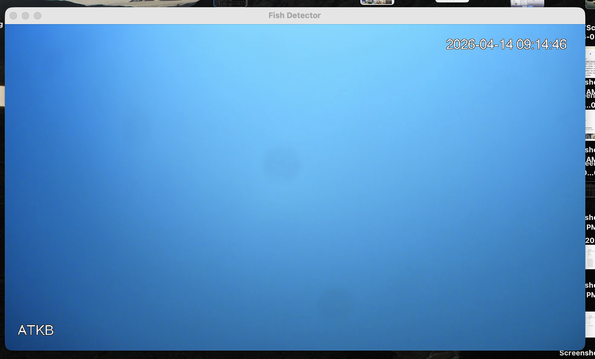
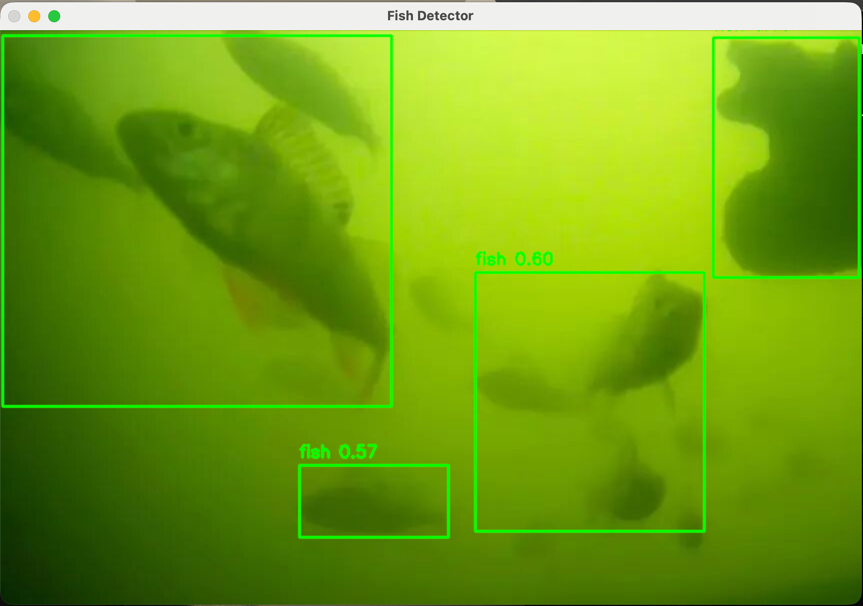

# fish_spotter
To detect fish from video stream.

## Setup & Training Toolchain

This project provides a complete toolchain for training a YOLO-based fish detection model.

### 1. Installation
```bash
pip install -r requirements.txt
```

#### CUDA setup (Windows/Linux with NVIDIA GPU)
If you want to run training or inference with `--device cuda`, install a CUDA-enabled PyTorch build first.

Prerequisites:
- NVIDIA GPU
- Recent NVIDIA driver
- Windows or Linux

Recommended install flow in a virtual environment:

```bash
python -m pip install --upgrade pip
python -m pip uninstall -y torch torchvision torchaudio
python -m pip install torch torchvision torchaudio --index-url https://download.pytorch.org/whl/cu121
python -m pip install -r requirements.txt
```

Verify CUDA is available:

```bash
python -c "import torch; print('torch:', torch.__version__); print('cuda available:', torch.cuda.is_available()); print('gpu:', torch.cuda.get_device_name(0) if torch.cuda.is_available() else 'none')"
```

If `cuda available: True`, you can run this project with `--device cuda` or `--device auto`.

> If you need a different PyTorch/CUDA combination, use the official selector: https://pytorch.org/get-started/locally/

Device notes:
- Windows/Linux with NVIDIA GPU: use CUDA (`--device cuda`) if your PyTorch install has CUDA support.
- macOS: CUDA is not available, use Apple Metal (`--device mps`).
- `--device auto` selects `cuda` first, then `mps` (macOS), otherwise `cpu`.

### 2. Dataset Preparation
First, set up the YOLO folder structure and copy your raw photos from `fish_photos/`:
```bash
python setup_dataset.py --setup --classes fish
```
> ⚠️ **`--classes` must exactly match your Label Studio label names** (case-sensitive, same order).
> Label Studio defaults to `Airplane` and `Car` — change them to your actual classes (e.g. `fish`) before labeling.
> The class order here determines the numeric IDs in YOLO label files (first class = `0`, second = `1`, etc.).

### 3. Labeling (Bounding Boxes)
Optional: generate rough YOLO pre-labels first (you will still review/correct them):
```bash
python prelabel_fish_images.py --model yolov8n.pt --conf 0.25
```

Start `label-studio` to annotate your images:
```bash
label-studio start
```
- Import images from `datasets/fish/raw_images`.
- Use auto-generated labels from `datasets/fish/exported_labels` as a starting point, then correct boxes.
- Label them as "fish".
- Export labels in **YOLO** format.
- Save the exported labels (unzip if necessary) into `datasets/fish/exported_labels/`.

### 4. Split Dataset
Organize the labeled images into train and validation sets:
```bash
python setup_dataset.py --split
```

### 5. Train Model
Run the training script (uses YOLOv8n by default):
```bash
python train_fish.py --epochs 50 --device auto
```
- Windows CUDA example: `python train_fish.py --epochs 50 --device cuda`
- The best model will be saved to `runs/detect/train/weights/best.pt`.

### 6. Inference (Detection)
Run the detection on a video stream or webcam:
```bash
python detect_fish_video.py --model runs/detect/train/weights/best.pt --source 0 --device auto
```
- Windows CUDA example: `python detect_fish_video.py --model model.pt --source 0 --device cuda`
- Replace `0` with a video/image file path or stream URL as needed.

### 7. Demo
Example live stream demo (Visdeurbel - Fish Doorbell Project):
```bash
python detect_fish_video.py --model runs/detect/train/weights/best.pt --source "https://visdeurbel.videostreams.nl/hls/visdeurbel/index.m3u8" --device auto
```
- The script overlays fish boxes and confidence on each frame.
- Press `q` to stop the stream window.

Demo screenshot:




